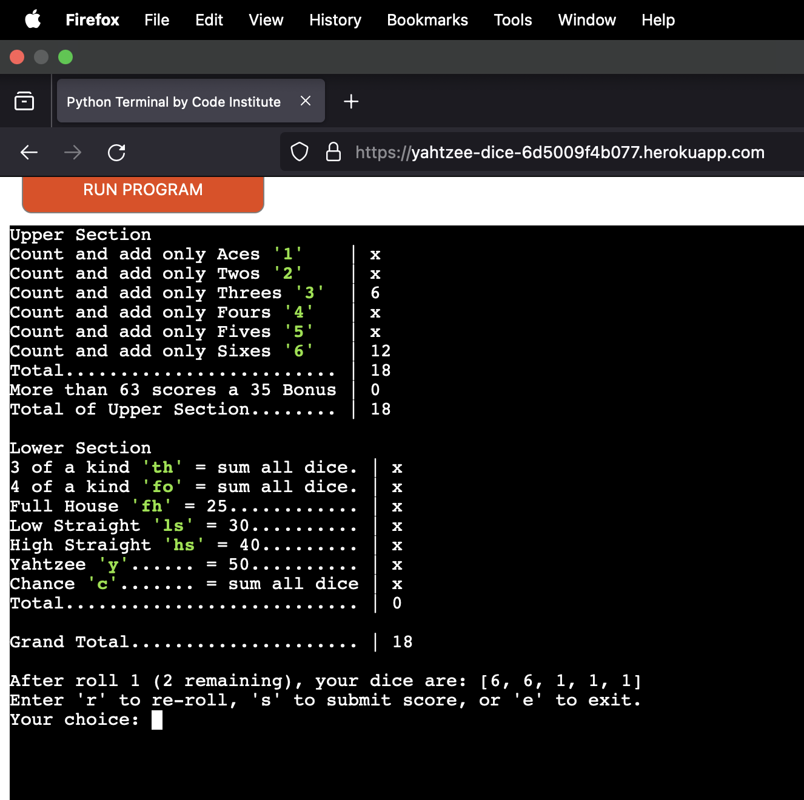

# __Code Validation__

## __Python Linter__

Python coding errors were caught and fixed using [CI pep8 linter](https://pep8ci.herokuapp.com/#). The deployed site returned no errors.

## __User Story Testing__

| As a user, I want to... | Requirement met | Image(s) |
| :---------------------- | :------------: | :------: |
| Play a solo, fun interactive game of Yahtzee and learn rules if needed. | YES |  |
| Input my name which will be used throughout the game | YES |   |
| Re-roll, submit score or escape home if desired. | YES |  |
| Easily select which dice I want to keep for re-roll | YES |  |
| Get feedback on how my dice will score against my chosen category and allow me to change my mind. | YES |  |
| View my updated scoreboard as I progress through the game. | YES |  |
| Compete against my personal best. | YES |  |

## __Input Validation by Function__

Every user input was validated for various incorrect inputs, as shown in the next sections, broken down by function.

| Function Tested | Inputs Validated | Validation Test | Expected Outcome | Actual Outcome | Pass/Fail |
| :-------------: | :--------------: | :-------------: | :--------------- | :------------: | :-------: |
| home() | 'r' or 'p' | '', number and invalid letter | Print error, repeat input prompt |  | PASS |
| home() | name string | '' and number | Print error, repeat input prompt. |  | PASS |
| user_prompt() | 'r', 's', or 'e' | '', number, and invalid letter | Print error, repeat input prompt. |  | PASS |
| keep_choice() | Numbers 1-5 separated by spaces | '', letter and invalid number | Print error, repeat input prompt |  | PASS |
| submit() | Strings contained within box_options list (numbers 1-5, or box 'key') | '', invalid number and invalid letter | Prints error justification and repeats prompt. | | PASS |
| points() | 'y' string. | Function uses .lower() method to convert to lowercase. | Call update_category function if true, else call submit function. |  | PASS |
| update_scoreboard() | Any input | '1' | Reset roll variable call roll_one function. |  | PASS |
| personal_best() | Any input | '' | Reset score, restart game, compare grand_total to 'pb' on next pass and provide user feedback | 

## __Browser Testing__

| Browser | Image(s) |
| ------- | :------: |
| Chrome |  |
| Firefox |  |
| Edge |  |

## __Debugging__

Bugs were tracked using GitHub's Issues functionality - click [here](https://github.com/alanjameschapman/yahtzee/issues)

Code blocks isolated and refactored using [python tutor](<https://pythontutor.com/>)
